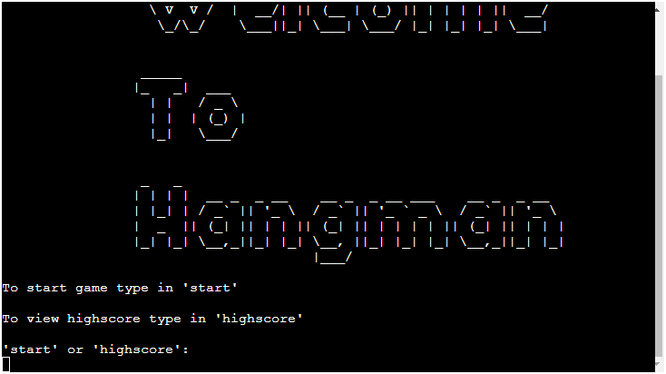
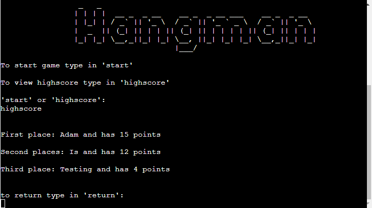
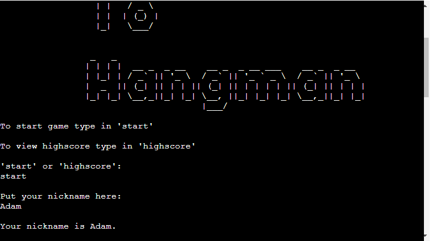
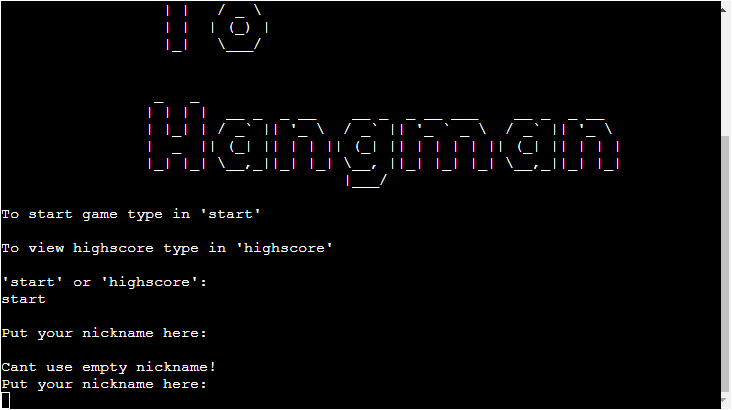

# Hangman

This is Portfolio Project 3 called Hangman
 
 
***placeholder for picutre***
 
 

- [Motivation](#)
- [User Experience](#)
    - [User Stories](#)
    - [Website Goals](#)
    - [Requirements](#)
    - [Expectations](#)
    - [Design](#)
    - [Wireframes](#)
        - [Desktop](#)
        - [Tablet](#)
        - [Mobile](#)
- [Website Structure](#)
- [Technology, Frameworks and Programs used](#d)
    - [Languages](#)
    - [Frameworks and programs used](#)
- [Features](#)
    - [Navigation bar](#)
- [Testing](#)
- [Testing user stories](#)
- [Deployment](#deployment)
- [Credits](#credits)

# Motivation

Portfolio Project 3 is about Hangman game. I have picked it to challenge myself and see how far I can go.
Main Purpose of this website is to play the game in CLI(Command Line Interface)

# User Experience(UX)

## User Stories
- I want user to be able to run and play the game in their browser.
- I want user to be able to input data into the game.
- I want user to see if they got the word correctly or not.
- I want user to be able to save the score.
- ***placeholder for more data***

## Project Goal

- Projects goal is to play Hangman game, check if provided input is correct or not and save the score.

## Requirements and Expectations

- Easy to understand game what to do as a player.
- Run the game through browser.
- Expect website to save score.
- Expect game to provide random word.
- Expect game to check if provided input is correct.

## Design

- Colors

    ***placeholder***

- Fonts

    ***placeholder***

- Images

    ***placeholder***

[Back to top](#hangman)

## Wireframes

- Mobile

    ***placeholder***

- Tablet

    ***placeholder***

- Desktop

    ***placeholder***

# Technology, Frameworks and Programs used.

## Languages

- [Python](https://en.wikipedia.org/wiki/Python_(programming_language))

## Programs and Frameworks

- [Lucid Charts](https://www.lucidchart.com/)
    -  Used for logic charts

# Features

- Main menu where you Type "start" to start the game or "highscore" to display top 3 scores(filled in with placeholders)

Picture

 

- Highscore, if you type in "return" it will return to the main menu above^

Picture

 

- Asks for nickname, if nickname empty throws an error!

Picture

 

- Rules, displays Rules in Ascii and prints out rules

Picture

 

- Word being displayed!

Picture

 

# Navigation

    - ***Placeholder***

# Testing

***loads of placeholders***

## Testing User Stories

- ***Placeholder***

# Bugs

    ***Placeholder***

# Deployment

    ***Placeholder***

# Credits 
- Slack Community and my Mentor!
- Tutor Support.
- [Simen Daehlin](https://github.com/Eventyret) My Mentor very Helpfull!.
- [The W3C Markup Validation Service](https://validator.w3.org/) Validation of HTML.
- [The W3C CSS Validation Service](https://jigsaw.w3.org/css-validator/) Validation of CSS.
- [JS Hint](https://jshint.com/) Debugging code. **************
- [AmIresponsive](https://ui.dev/amiresponsive) for responsive look of my website.
- [Autoprefixer](https://autoprefixer.github.io/) used to prefix CSS. **************
- [Colorhexa](https://www.colorhexa.com/) was used to take colors from for readme.************
