# Hangman

This is Portfolio Project 3 called Hangman
 
 
***placeholder for picutre***
 
 

- [Motivation](#)
- [User Experience](#)
    - [User Stories](#user-stories)
    - [Project Goal](#project-goal)
    - [Requirements and Expectations](#requirements-and-expectations)
    - [AppFlow](#appflow)
- [Technology, Frameworks and Programs used](#d)
    - [Languages](#languages)
    - [Dependencies and Programs used](#dependencies-and-frameworks)
- [Features](#features)
- [Testing](#testing)
- [Testing user stories](#testing-user-stories)
- [Deployment](#deployment)
- [Credits](#credits)

# Motivation

Portfolio Project 3 is about Hangman game. I have picked it to challenge myself and see how far I can go.
Main Purpose of this website is to play the game in CLI(Command Line Interface)

# User Experience(UX)

## User Stories
- I want user to be able to run and play the game in their browser.
- I want user to be able to put there nickname in game.
- I want user to be able to save their score if they guess the word correctly if they decide to finish.
- I want user to be able to guess the words letters replaced with _ and if guessed correctly to replace them with correct letter.
- I want user to display highscore of top 3 scores(they are filled in with placeholders to display).
- I want user to have 7 lives and if you use all of them to be displayed with Game Over text.
- I want user to be able to play game again if they lost all of their lives by playing game again.

## Project Goal

- Projects goal is to play Hangman game, check if provided input is correct or not, save the score and display highscores.

## Requirements and Expectations

- Easy to understand game what to do as a player.
- Run the game through browser.
- Expect website to save score.
- Expect game to provide random word.
- Expect game to check if provided input is correct.
- Expect game to have highscore system displayed at begining.

## Appflow

- Starting logic containing Start and Highscore.
 

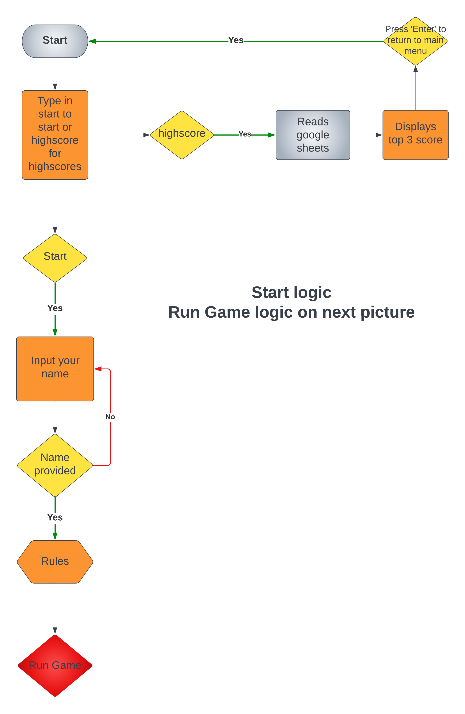

- Game logic containing everything else that happens in game from printing the word to checking it and saving score.
 

[Back to top](#hangman)

# Technology, Frameworks and Programs used.

## Languages

- [Python](https://en.wikipedia.org/wiki/Python_(programming_language))

- [JavaScript](https://en.wikipedia.org/wiki/JavaScript)
    - Sorting data in google sheets descending order on changes in file.
    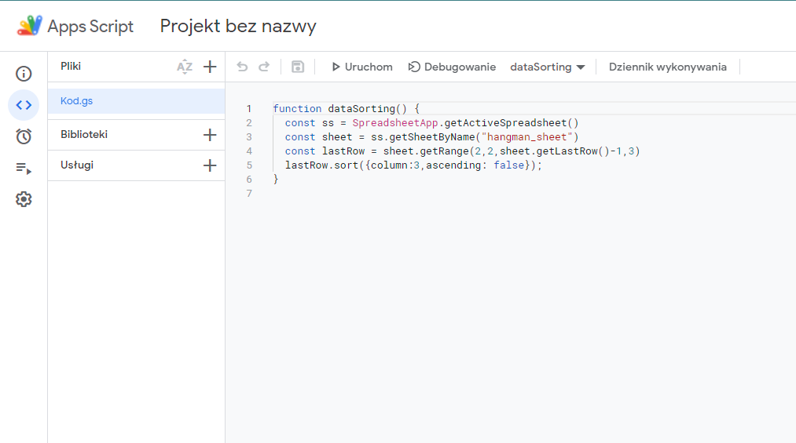

## Dependencies and Frameworks

- [Lucid Charts](https://www.lucidchart.com/)
    - Used for logic charts

- [Gspread](https://docs.gspread.org/en/v5.7.0/)
    - Used to access google sheets to manipulate, save and read data of it.

- [Time Library](https://docs.python.org/3/library/time.html)
    - Used to time code execution.

- [Random Library](https://docs.python.org/3/library/random.html)
    - Used to randomize words if API is down giving status code 503.

- [OS](https://docs.python.org/3/library/os.html)
    - Used to clear terminal before new word is being displayed.

- [Art](https://pypi.org/project/art/)
    - Used to make ASCII art from words used in function center_text.

- [PEP8 Code Institute](https://pep8ci.herokuapp.com/#)
    - Used to linter Python code and see if any mistakes or issues come up.

- [Random word API](https://random-word-api.herokuapp.com/home)
    - Used to display random word, was down for a while and had to develop defensive code for that.

# Features

### Main menu where you Type "start" to start the game or "highscore" to display top 3 scores(filled in with placeholders)

Picture

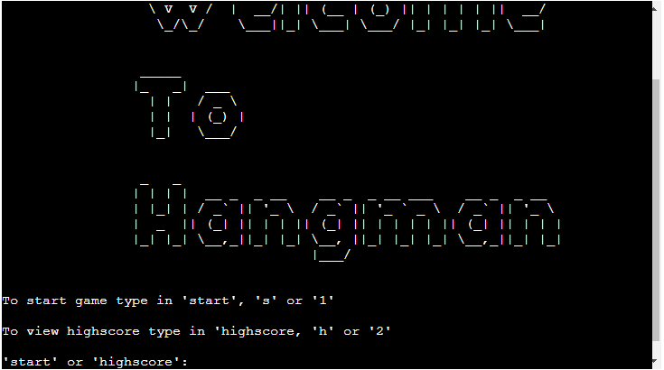

 

### Highscore, if you press 'Enter' it will return to the main menu above^

Picture

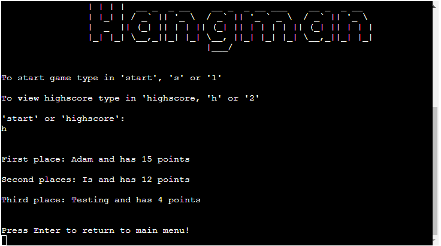

 

### starting game asks for nickname, if nickname empty throws an error!

Picture

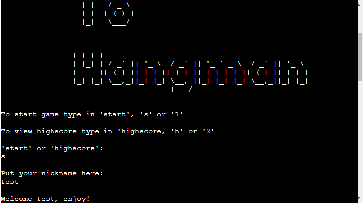
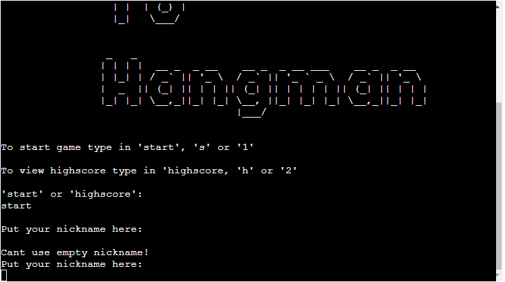

 

### Rules, displays Rules in Ascii and prints out rules

Picture

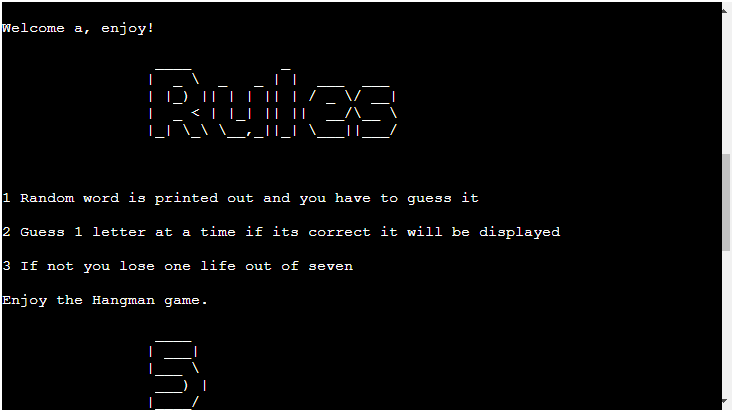

 

### Word being displayed!

Picture

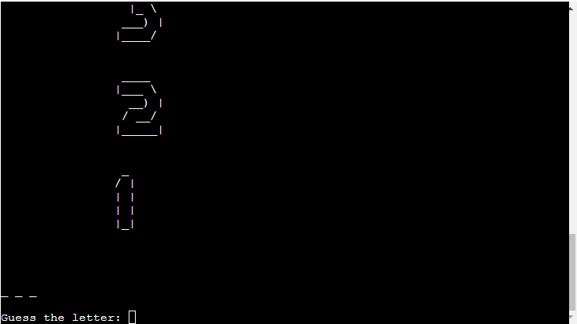
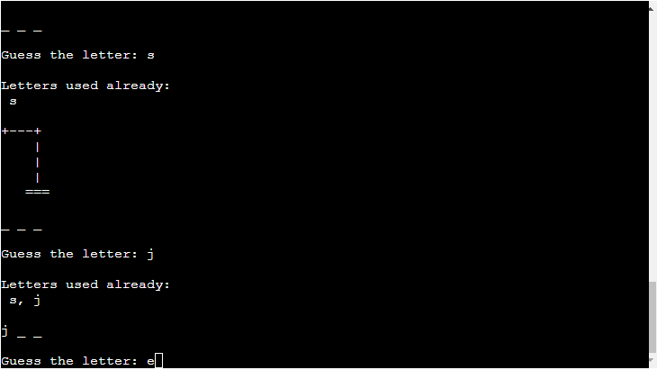
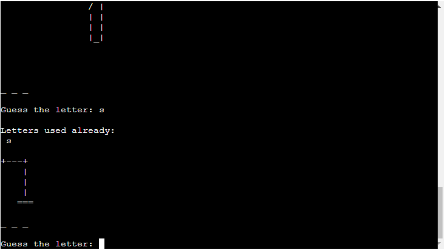

 

### Guessed the word!

Picture

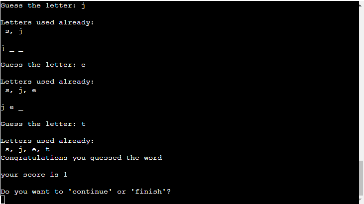

 

### Continue/New word printed

Picture

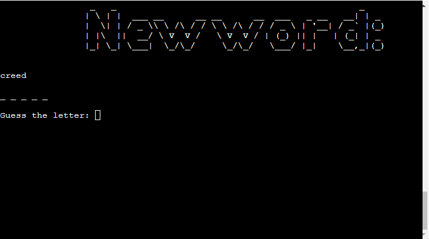

 

### Game over you are out of lives!

Picture

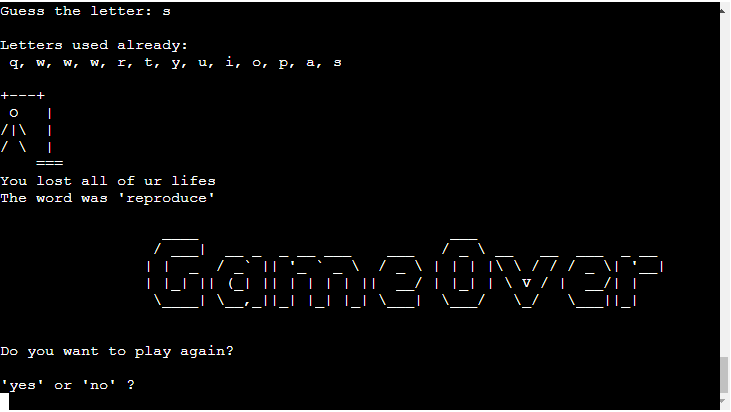

 

### When game over do you want to play again?

Picture

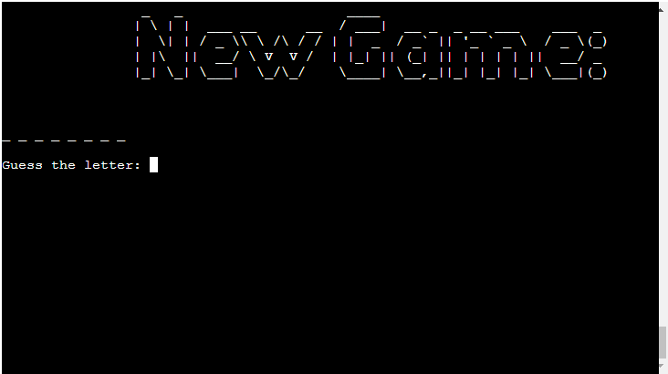

 

### Finish/Saving score and finishing

Picture

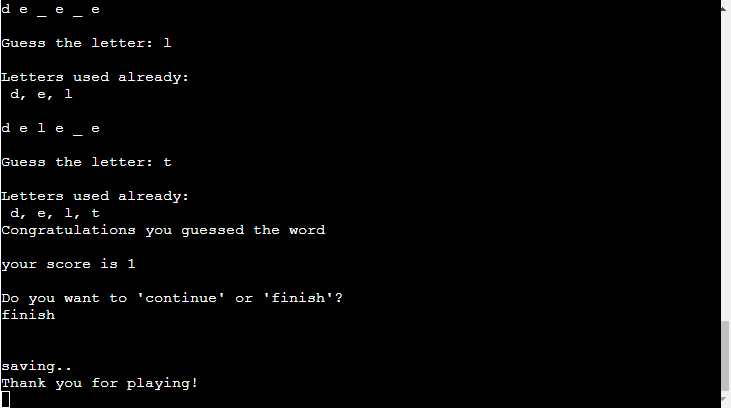

 

### Finished game saves to Google Sheets and sorts it descending/from highest to lowest

Picture

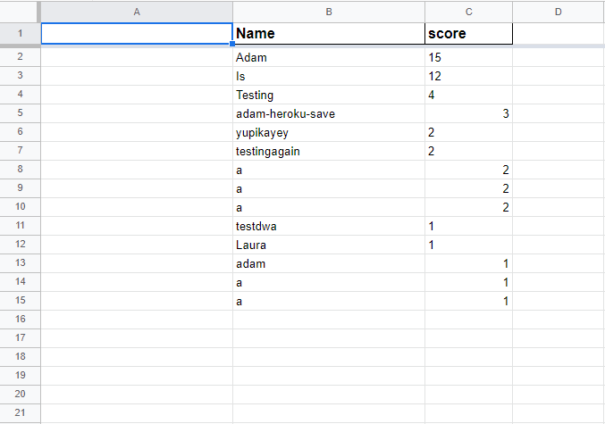

 

# Testing

1. I have tested my game so many times in gitpod terminal itself having issues and bugs thrown left and right. Big issue was when API would pass you a string of words that would include "" and []. I had to get rid of those and then take the words and put in new list of words and then pass it on to another function to accept lower case letters.

2. Another issue i came up was same word being assigned more than once, function wouldnt roll another word from list or API.
I had to reasign variable again before function was called again to pick another word.
    

Picture

    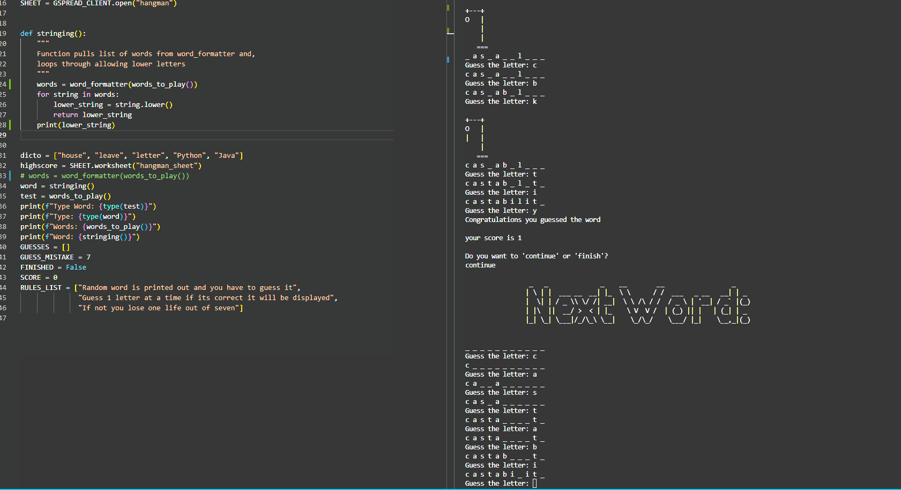
    

 

3. I have encountered bug where if I have checked if input user provides is Yes or No it would always be Yes or True.
I had to redo the checking instead of **user_input == "yes" or "no"** made it as **user_input in ["yes", "no"]** that solved my issue and changed all if statements checking users input.

4. I have encountered issue with putting capital letters or lower case letters in guessing or users input where it would throw errors that its invalid input, as I assigned in defensive code. I had to make **user_input.lower()** in every input check so even if its capital letter in guessed letter it would adjust it and not throw error for invalid input.

5. Biggest issue i have encountered was when API died, I had to develop function that checks if its responding giving error 200 or not responding giving error 503. I have made a function that checks the status code and if its 503 to use txt file with words in it, and if its responding to use the API.

6. I had one issue with indentation as well that wouldnt check if all letters are correct and if so to finish the game.
    

Picture

    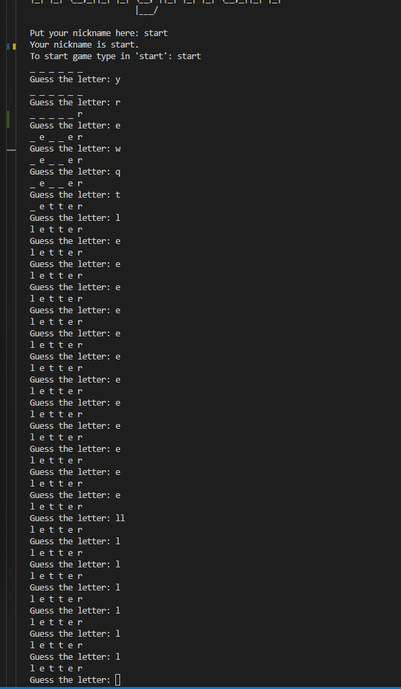
    

 

7. I found issue where hangman ascii wouldnt print, had to reasign variable with lives to be as with starting the game!
    

Picture

    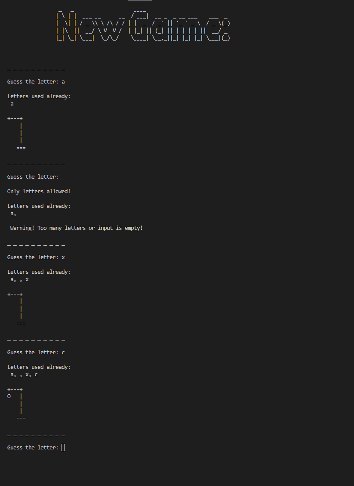
    

 

## PEP8 Linter from Code Institute

- run.py ran through pep8 linter and found no errors
    

Picture

    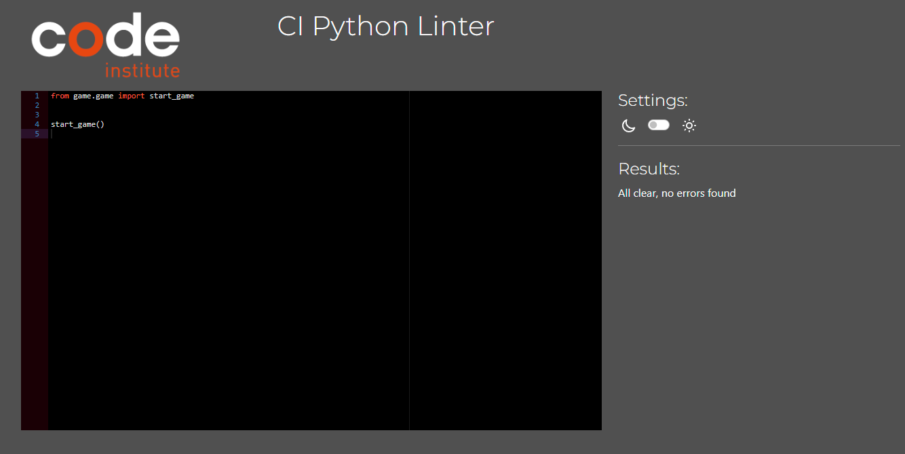
    

 

- utils.py ran through pep8 linter and found no errors
    

Picture

    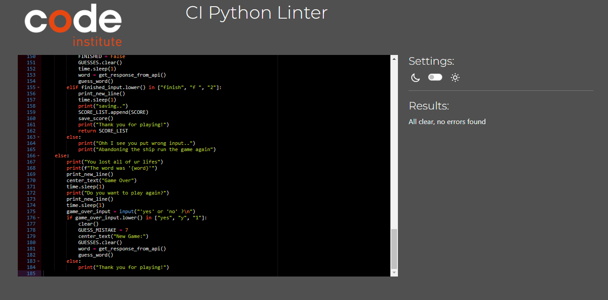
    

 

- ascii_art.py ran through pep8 linter and errors are found, they are justified to print ascii art for hangman.
    

Picture

    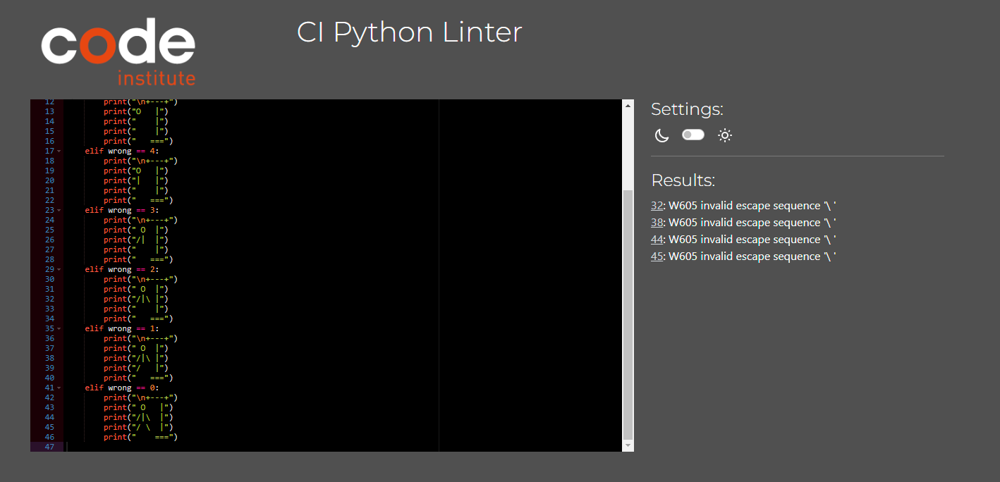
    

 

- game.py ran through pep8 linter and no errors found.
    

Picture

    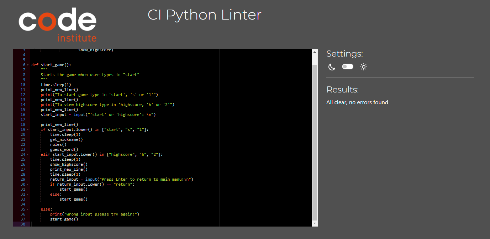
    

 

- api.py ran through pep8 linter and no errors found.
    

Picture

    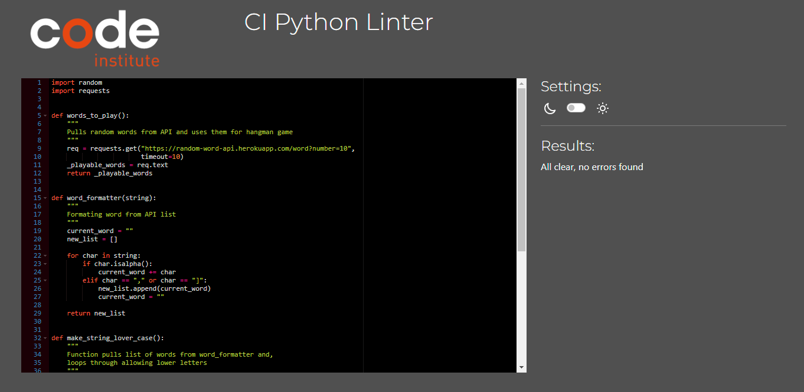
    

 

- settings.py ran through pep8 linter and no errors found.
    

Picture

    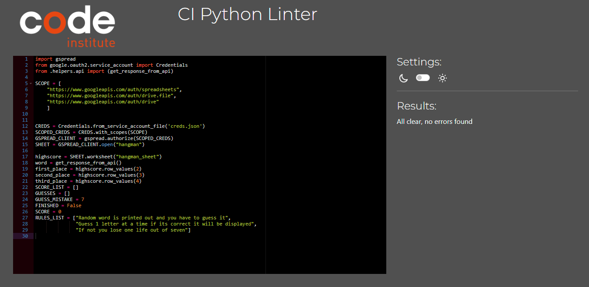
    

 

## Testing User Stories

- ***Placeholder***

# Bugs

1. Nickname can be space, tried to figure it out but failed so far.
2. Numbers are taken in as input, made error pop up saying letters only allowed.
3. Letters or numbers used again throw an error but keep getting added to list of GUESSES.
4. If API is down, txt file will give words in defensive code but there is chance of same word coming up more than once.

# Deployment

    ***Placeholder***

# Credits 
- Slack Community and my Mentor!
- Tutor Support, [Scott](https://github.com/ShavingSeagull) and [Joshua](https://github.com/LordButley)
- [Simen Daehlin](https://github.com/Eventyret) My Mentor very Helpfull!.
- [The W3C Markup Validation Service](https://validator.w3.org/) Validation of HTML.
- [The W3C CSS Validation Service](https://jigsaw.w3.org/css-validator/) Validation of CSS.
- [AmIresponsive](https://ui.dev/amiresponsive) for responsive look of my website.
- [Officedemy](https://www.officedemy.com/how-to-automatically-sort-in-google-sheets/) JS code to sort score highest to lowest.